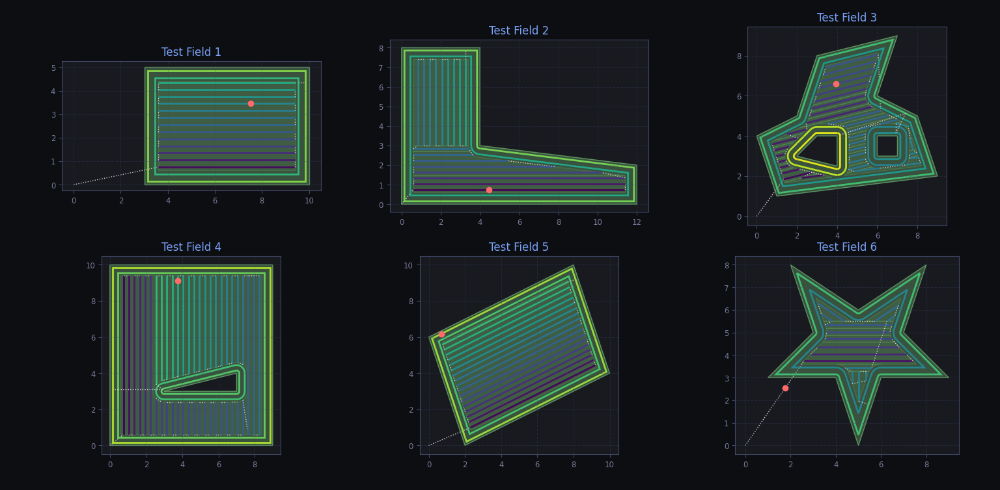

# fieldpath

A Python package for generating optimized coverage paths for agricultural fields and other polygonal areas. Built on top of [Shapely](https://shapely.readthedocs.io/).



## Features
- **Any Field Geometry** - Works with Shapely Polygon Objects that may have holes. Shapely Polygons are vector based and can be easily created from any vector file format.
- **A-B Line Generation** – Parallel swath patterns at any angle
- **Contour Path Generation** – Follow field boundaries with configurable insets
- **Polygon Decomposition** – Trapezoidal decomposition for complex/concave fields - For more efficient paths concave field geometries can be processed as multiple concave objects.
- **Path Optimization** – Greedy nearest-neighbor sequencing to minimize traversal distance
- **Obstacle Avoidance** – Support for fields with holes (e.g., ponds, trees)
- **Traversal Planning** – Automatic path connections that stay within field boundaries
- **Respects Vehicle capabilities** - Uses Dubins-Algorithm to generate curved traversal paths, according to the vehicles minimum turn radius. Also sharp corners in the working paths can be replaced with either Dubins Paths or filleted by the turn radius
- **Visualization** – Built-in plotting with animated path preview

## Installation

```bash
    pip install https://github.com/HB0N0/fieldpath.git
```
Or clone the repo and install manually

```bash
    git clone https://github.com/HB0N0/fieldpath.git
    cd fieldpath
    pip install .
```

# Example
Basic path planning on a shapely polygon

```python
from shapely import Polygon
from fieldpath.planner import FieldPathPlanner

# Simple field geometry
field = Polygon([(0,0), (10,0), (10,5), (5,5), (5,10), (0,10)])

# Initialize FieldPathPlanner
fp = FieldPathPlanner(working_width=0.5, turn_radius=1.0)
# Generate operation paths
working_path = fp.generate_contoured_a_b_paths(field, 
                                               num_contour_lines=2)
# operation paths is a MultiLineString with all paths that need operation

# Next generate work sequence
full_path, line_types = fp.generate_work_sequence(working_path, 
                                                  start_pose=(0,0,0), 
                                                  end_pose=(0,0,0), 
                                                  field=field)

# full_path is a LineString with the complete path including transitions
# line_types is a list of strings indicating the type of each segment in full_path ('traversal', 'operation')
```